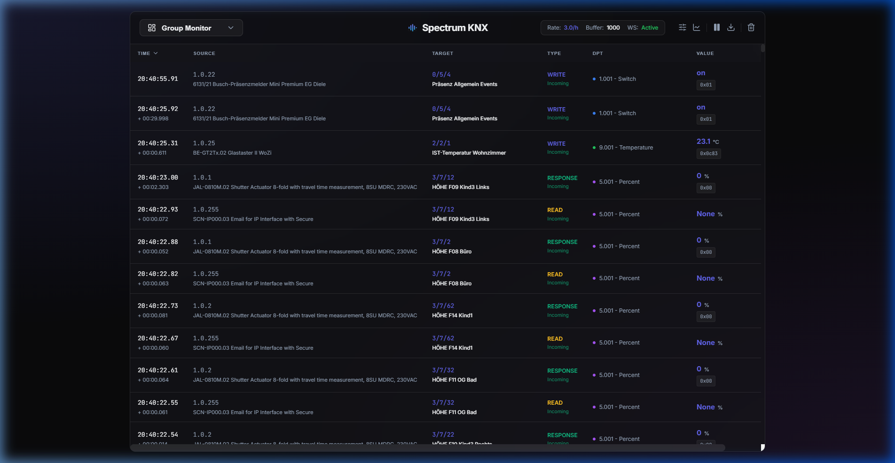

# Spectrum KNX 

<p align="center">
  
</p>

<p align="center">
  <em>An elegant, high-performance bus traffic monitor and visualizer for KNX Home Automation.</em>
</p>



Spectrum KNX is a dedicated tool to record, store, search, and visualize KNX bus telegrams indefinitely. Built for speed and reliability, it merges a robust TimescaleDB backend with a premium, real-time React web interface.

## 📺 Demo in Action


## 🚀 Features

- **Live Group Monitor:** Monitor bus load, traffic rate, and instantaneous payloads in real-time.
- **Historical Analysis:** Search millions of past telegrams instantly with powerful backend query engines. 
- **Time-Delta Context:** Automatically capture the events "before and after" a filtered event to debug logic faults.
- **Data Rendering:** Dynamically graph numerical readouts over time, grouped by physical unit types.
- **Zero Loss:** Pause the live feed without dropping packets—everything queues silently in the background buffer until you resume.

## 🐳 Quick Start (Docker Compose)

The easiest way to run Spectrum KNX is with Docker Compose. This automatically provisions the TimescaleDB database alongside the KNX Tracker daemon.

1. Copy the example environment file: `cp .env_example .env`
2. Set your `KNX_PASSWORD`, `KNX_PROJECT_PATH` and `KNX_GATEWAY_IP` in `.env`.
3. Run the stack:

   **Development (Live Code):**
   ```bash
   docker-compose up -d
   ```

   **Production (Pre-built image):**
   ```bash
   docker-compose -f docker-compose.yml -f docker-compose.prod.yml up -d
   ```

4. Access the web interface at `http://localhost:8000` (or `http://localhost:5173` in Dev mode).

### Detailed Guides
See [DEVELOPMENT.md](DEVELOPMENT.md) for local setup, [DEPLOYMENT.md](DEPLOYMENT.md) for production configuration, and the [Kubernetes templates](kubernetes/README.md) for cluster deployment.

## 🛠 Tech Stack
- **Backend:** Python 3.11+, FastAPI, `xknx`, WebSocket Streaming
- **Database:** PostgreSQL + TimescaleDB
- **Frontend:** React, TypeScript, Vite, TanStack Table, uPlot

## 🤝 Contributing
Interested in building out new visualization blocks or analytical filters? See our [CONTRIBUTING.md](CONTRIBUTING.md) guide!

## 📜 License
Licensed under the GNU General Public License v3.0 (GPLv3). See [LICENSE](LICENSE) for details.
